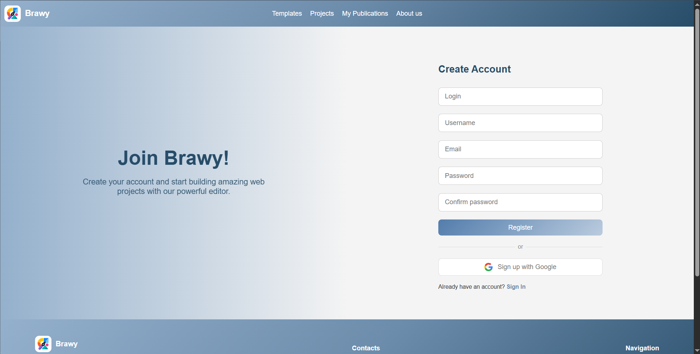
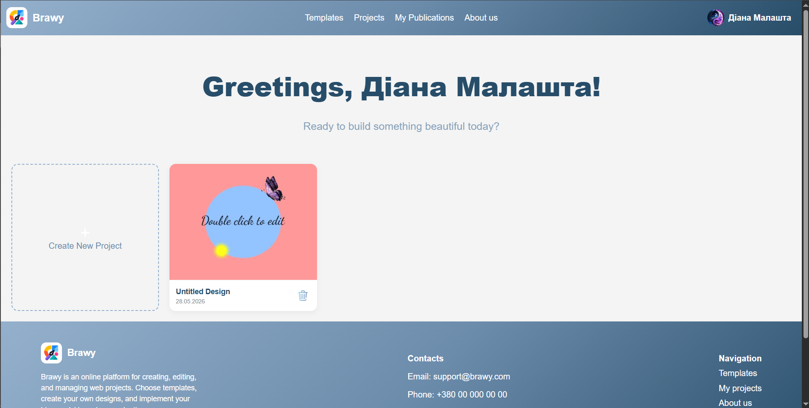
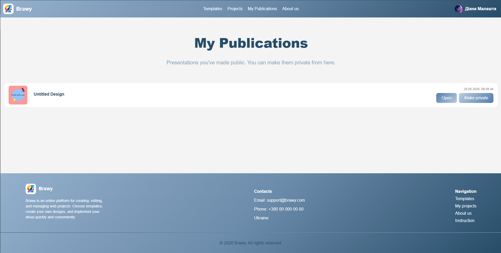
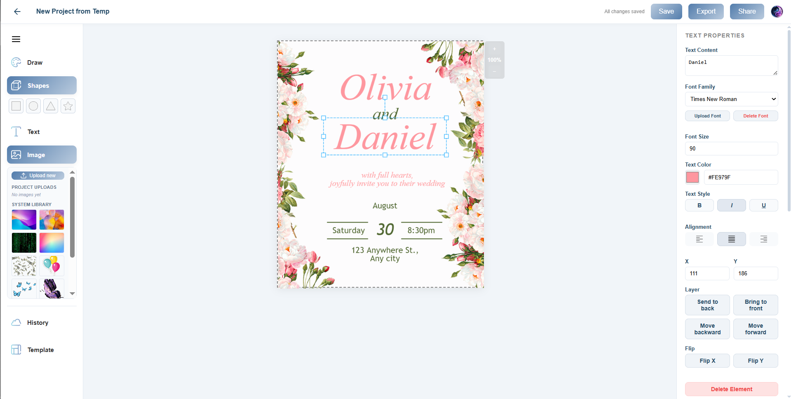
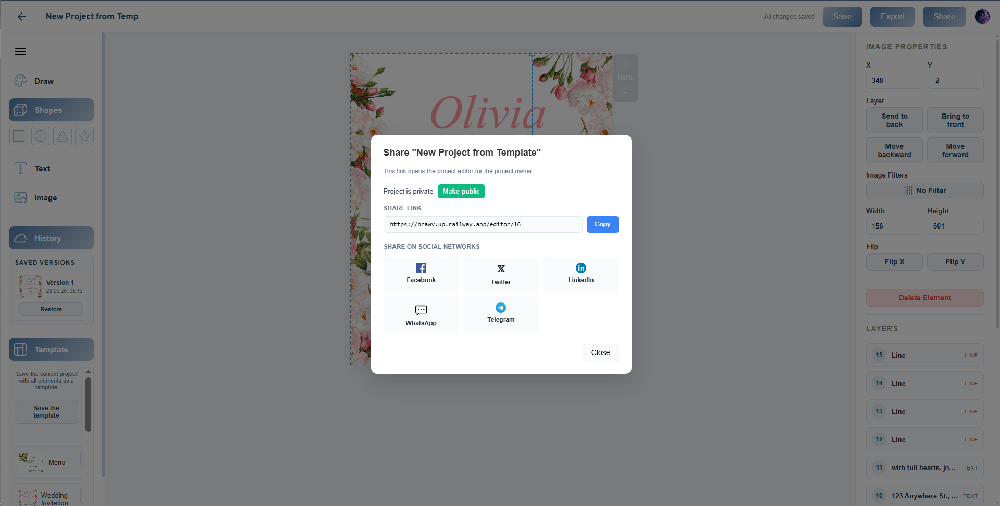

<div align="center">
  
# Brawy
 
### *Your first brave steps into design*
 
Brawy is a modern browser-based graphics editor that makes creating visuals fast, convenient, and accessible to everyone — no design skills required.

</div>

---

## Table of Contents

- [Features](#features)
- [Technical Stack](#technical-stack)
- [Getting Started](#getting-started)
  - [Prerequisites](#prerequisites)
  - [Running with Docker (recommended)](#running-with-docker-recommended)
  - [Running locally without Docker](#running-locally-without-docker)
- [Environment Variables](#environment-variables)
- [Project Structure](#project-structure)
- [API Documentation](#api-documentation)
- [Screenshots](#screenshots)
- [Authors](#authors)
- [License](#license)

---

## Features

**User Authentication** — Register and login using password and email/login or using Google, edit your profile, reset password via email.

**Canvas Editor**

- Create projects from scratch or from templates
- Add and style text — font family, size, color, bold, italic, underline, alignment
- Draw freely — pen, marker, straight line, arrow, dashed line, eraser
- Add shapes — rectangle, ellipse, triangle, star with color and corner radius controls
- Upload images and add them to the canvas; apply filters (Grayscale, Sepia, Invert, Blur, Brighten)
- Move elements with mouse drag or arrow keys; resize and rotate with transformer handles
- Delete elements from canvas
- Zoom in/out on canvas with mouse wheel or buttons
- Resize canvas (width and height) at any time
- Snap-to-center guides when dragging elements
- Grid overlay for precise positioning
- Layer panel — reorder, bring to front, send to back
- Flip elements horizontally or vertically
- Copy/paste elements (Ctrl+C / Ctrl+V)
- Undo/Redo local history (Ctrl+Z / Ctrl+Y)

**Fonts** - Use system fonts or upload custom fonts (TTF, WOFF, WOFF2, OTF)

**Project Management**

- Save projects with auto-generated thumbnails
- Version history — up to 20 saved versions per project, restore any version
- Save project as a user template for reuse
- System templates (Instagram Post, Instagram Story, Poster, YouTube Thumbnail)
- Delete projects with confirmation

**Export & Sharing**

- Export as PNG, JPG, PDF, SVG
- Optional transparent background for PNG and SVG exports
- Share project via public link
- Share to Facebook, Twitter, LinkedIn, WhatsApp, Telegram
- Make project public / private

## Technical Stack

| Layer                 | Technology                                                             |
| --------------------- | ---------------------------------------------------------------------- |
| Frontend              | React 19, TypeScript, Konva / react-konva, Zustand, React Router       |
| Backend               | NestJS 11, TypeScript, Passport.js, JWT, Swagger, Multer, Google OAuth |
| Database              | PostgreSQL 15 via Prisma ORM                                           |
| Cache / Rate limiting | Redis (optional, configurable)                                         |
| File storage          | Cloudinary                                                             |
| Email                 | Nodemailer (Gmail SMTP)                                                |
| Containerization      | Docker, Docker Compose                                                 |
| Reverse proxy         | Nginx                                                                  |

---

## Getting Started

### Prerequisites

To run with Docker you only need:

- [Docker](https://www.docker.com/get-started) and Docker Compose (included with Docker Desktop)

To run locally without Docker you also need:

- Node.js 22+
- PostgreSQL 15+
- Redis (optional — only needed if you enable Redis-based throttling)

---

### Running with Docker (recommended)

This is the easiest way to run the full application with all services.

**1. Clone the repository**

```bash
git clone (https://github.com/Butterfly2112/brawy.git
cd brawy
```

**2. Create the `.env` file in the root directory** (next to `docker-compose.yml`)

Copy the example below and fill in your values — see [Environment Variables](#environment-variables) for details.

```bash
cp .env.example .env
# then edit .env with your values
```

**3. Build and start all services**

```bash
docker compose up --build
```

This command builds Docker images for the backend and frontend, starts PostgreSQL and Redis containers, runs Prisma migrations and seeds the database with system templates, and starts everything together.

The first build takes a few minutes. Subsequent starts are much faster.

**4. Open the app**

```
http://localhost
```

The backend API is available at `http://localhost/api` and Swagger docs at `http://localhost/api/docs`.

**To stop everything:**

```bash
docker compose down
```

**To stop and remove all data (database volumes):**

```bash
docker compose down -v
```

---

### Running locally without Docker

Use this approach if you want faster hot-reload during development.

#### Backend

**1. Create a PostgreSQL database**

Create a new database in your local PostgreSQL instance and note the connection details.

**2. Set up the backend environment**

```bash
cd server
cp .env.example .env
# edit .env with your DATABASE_URL and other values
```

**3. Install dependencies and set up the database**

```bash
npm install
npm run prisma:generate
npm run prisma:migrate
npm run prisma:seed
```

**4. Start the backend**

```bash
npm run start:dev
```

The server starts at `http://localhost:3000`. Swagger is at `http://localhost:3000/api/docs`.

#### Frontend

**1. Set up the frontend environment**

```bash
cd client
```

The frontend proxies all `/api` requests to `http://localhost:3000` automatically via the Vite dev server config — no extra configuration needed.

**2. Install dependencies and start**

```bash
npm install
npm run dev
```

The app opens at `http://localhost:5173`.

---

## Environment Variables

Create a `.env` file in the root directory with these variables:

```env
# PostgreSQL
POSTGRES_USER=brawy
POSTGRES_PASSWORD=your_password
POSTGRES_DB=brawy_db

# Backend
NODE_ENV=production
BACKEND_PORT=3000
FRONTEND_URL=http://localhost

# Database (uses the Docker service name "db" inside Docker network)
DATABASE_URL=postgresql://brawy:your_password@db:5432/brawy_db

# JWT
JWT_ACCESS_SECRET=your_access_secret_here
JWT_REFRESH_SECRET=your_refresh_secret_here

# Email (Gmail SMTP)
SMTP_SERVICE=gmail
SMTP_USER=your@gmail.com
SMTP_PASS=your_gmail_app_password
HOST_FOR_EMAIL=localhost
PORT_FOR_EMAIL=80

# Google OAuth
GOOGLE_CLIENT_ID=your_google_client_id
GOOGLE_CLIENT_SECRET=your_google_client_secret
GOOGLE_CALLBACK_URL=http://localhost/api/auth/google/callback

# Cloudinary
CLOUDINARY_CLOUD_NAME=your_cloud_name
CLOUDINARY_API_KEY=your_api_key
CLOUDINARY_API_SECRET=your_api_secret
```

**How to get each service credential:**

- **Gmail App Password** — Google Account → Security → 2-Step Verification → App passwords. Use the generated 16-character password as `SMTP_PASS`.
- **Google OAuth** — [Google Cloud Console](https://console.cloud.google.com) → APIs & Services → Credentials → Create OAuth 2.0 Client ID. Add `http://localhost/api/auth/google/callback` to Authorized redirect URIs.
- **Cloudinary** — [cloudinary.com](https://cloudinary.com) → free account → Dashboard shows your cloud name, API key, and API secret.

---

## Project Structure

```
brawy/
├── docker-compose.yml        # Orchestrates all services
├── .env                      # Root environment variables (git-ignored)
│
├── server/                   # NestJS backend
│   ├── Dockerfile
│   ├── src/
│   │   ├── auth/             # Registration, login, JWT, Google OAuth
│   │   ├── user/             # Profile management
│   │   ├── project/          # Projects, history, assets, sharing
│   │   ├── export/           # SVG export with embedded fonts and images
│   │   ├── font/             # Custom font upload and management
│   │   ├── upload/           # Cloudinary integration
│   │   ├── email/            # Nodemailer email service
│   │   └── prisma/           # Prisma schema, migrations, seed
│   └── package.json
│
└── client/                   # React frontend
    ├── Dockerfile
    ├── nginx.conf            # Nginx config with API proxy
    ├── src/
    │   ├── pages/            # Login, Register, Home, Editor, Templates, Publications
    │   ├── components/       # Header, Footer, WorkspaceCanvas, modals
    │   ├── api/              # API client functions
    │   └── store/            # Zustand auth store
    └── package.json
```

---

## API Documentation

When the app is running, interactive Swagger documentation is available at:

```
http://localhost/api/docs
```

All endpoints are documented with request/response schemas, authentication requirements, and example values.

---

## Screenshots








---

## Authors

This is an educational team project for Innovation Campus NTU "KhPI", FullStack Track Challenge.

### Team Members

- **Anastasiia Shyrkova**
- **Diana Malashta**
- **Kateryna Lytovchenko**

## License

This project is developed for educational purposes at NTU "KhPI".
